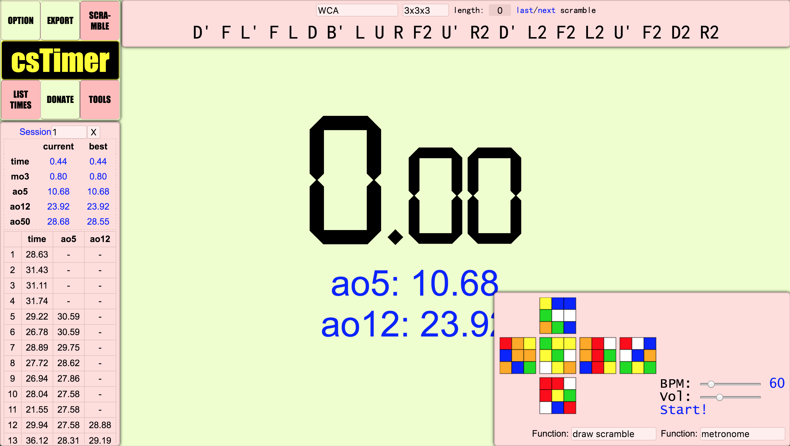
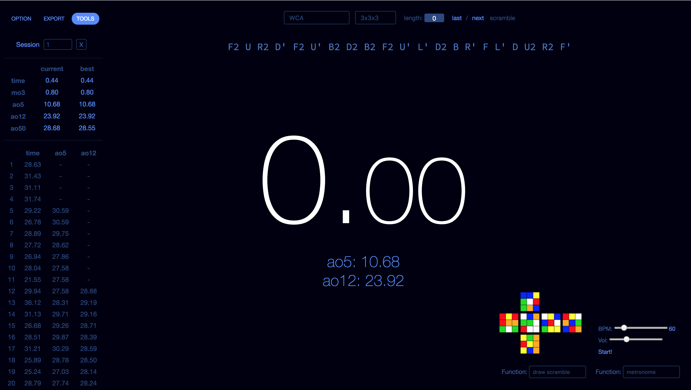

# csTimer Refined

*TODO: some sort of logo here?*

A userstyle for [csTimer](https://cstimer.net/) that makes it look much more familiar to the modern web. This is a fork of [backus/cstimer-makeover](https://github.com/backus/cstimer-makeover) with some additional bug fixes and features.

> [!IMPORTANT] 
> This project is under heavy development, so things aren't finished yet

*TODO: design goals and philosophy here*

## Before

## After

## Credit

* *TODO: reference backus/cstimer-makeover here*
* Thanks to [@alainmeier](https://github.com/alainmeier) for doing most of the styling
